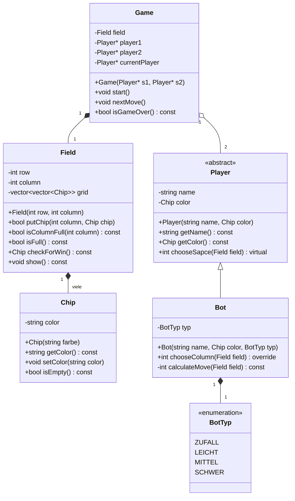

```mermaid
classDiagram
    class Chip {
        -string color
        +Chip(string farbe)
        +string getColor() const
        +void setColor(string color)
        +bool isEmpty() const
    }

    class Field {
        -int row
        -int column
        -vector~vector~Chip~~ grid
        +Field(int row, int column)
        +bool putChip(int column, Chip chip)
        +bool isColumnFull(int column) const
        +bool isFull() const
        +Chip checkForWin() const
        +void show() const
    }

    class Player {
        <<abstract>>
        -string name
        -Chip color
        +Player(string name, Chip color)
        +string getName() const
        +Chip getColor() const
        +int chooseSapce(Field field) virtual
    }

    class BotTyp {
        <<enumeration>>
        ZUFALL
        LEICHT
        MITTEL
        SCHWER
    }

    class Bot {
        -BotTyp typ
        +Bot(string name, Chip color, BotTyp typ)
        +int chooseColumn(Field field) override
        -int calculateMove(Field field) const
    }

    class Game {
        -Field field
        -Player* player1
        -Player* player2
        -Player* currentPlayer
        +Game(Player* s1, Player* s2)
        +void start()
        +void nextMove()
        +bool isGameOver() const
    }

    Player <|-- Bot
    Field "1" *-- "viele" Chip
    Bot "1" *-- "1" BotTyp
    Game "1" *-- "1" Field
    Game "1" o-- "2" Player

```