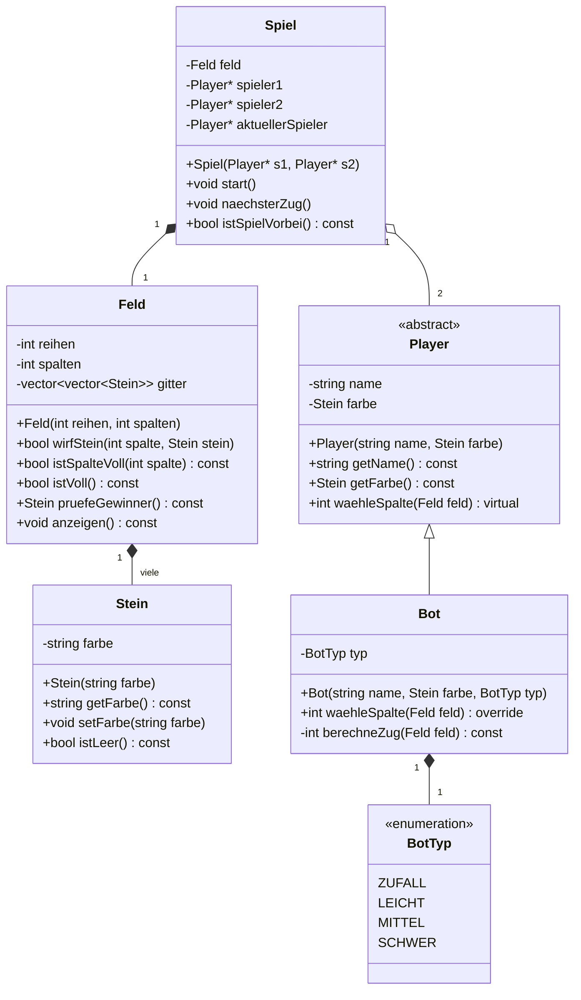

```mermaid
classDiagram
    class Stein {
        -string farbe
        +Stein(string farbe)
        +string getFarbe() const
        +void setFarbe(string farbe)
        +bool istLeer() const
    }

    class Feld {
        -int reihen
        -int spalten
        -vector~vector~Stein~~ gitter
        +Feld(int reihen, int spalten)
        +bool wirfStein(int spalte, Stein stein)
        +bool istSpalteVoll(int spalte) const
        +bool istVoll() const
        +Stein pruefeGewinner() const
        +void anzeigen() const
    }

    class Player {
        <<abstract>>
        -string name
        -Stein farbe
        +Player(string name, Stein farbe)
        +string getName() const
        +Stein getFarbe() const
        +int waehleSpalte(Feld feld) virtual
    }

    class BotTyp {
        <<enumeration>>
        ZUFALL
        LEICHT
        MITTEL
        SCHWER
    }

    class Bot {
        -BotTyp typ
        +Bot(string name, Stein farbe, BotTyp typ)
        +int waehleSpalte(Feld feld) override
        -int berechneZug(Feld feld) const
    }

    class Spiel {
        -Feld feld
        -Player* spieler1
        -Player* spieler2
        -Player* aktuellerSpieler
        +Spiel(Player* s1, Player* s2)
        +void start()
        +void naechsterZug()
        +bool istSpielVorbei() const
    }

    Player <|-- Bot
    Feld "1" *-- "viele" Stein
    Bot "1" *-- "1" BotTyp
    Spiel "1" *-- "1" Feld
    Spiel "1" o-- "2" Player

```